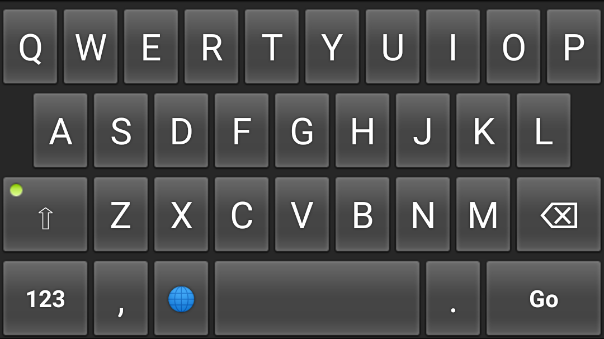

# Tiny Keyboard

## About

- Smallest possible APK size under 40kB (as of version 1.0)
- Permissions: 0
- Supported layouts: en_US
- No Launcher icon and Settings
- Licensed under Apache License Version 2

## Features

- **Key Popup Preview**: Highlighting popup preview above pressed keys for enhanced typing feedback and UX (toggleable in Settings).
- **Dedicated Number Row**: Optional number row (`1 2 3 4 5 6 7 8 9 0`) across the top of the keyboard for quick access to digits (toggleable in Settings).
- **Clipboard Toolbar**: Clean top toolbar with a clipboard button (`📋`) and quick-paste badges for recent copied text to paste in 1 tap, plus a full clipboard history drawer with clear-all (toggleable in Settings).
- **Spacebar Cursor Slide**: Scroll / slide left and right on the spacebar to move the typing cursor left and right through text with subtle haptic ticks. Includes an adjustable sliding sensitivity slider in Settings.
- **Lowercase as Default**: Starts and types in lowercase by default, avoiding unwanted auto-capitalization (with an optional auto-capitalization toggle in Settings).
- **Material 3 UI**: Clean, rounded key cards with native state feedback and zero legacy text shadows.
- **Theme Selection**: Choose between **Legacy** (classic AOSP style, default), **Auto** (follows system dark mode), **Light**, or **Dark** themes.
- **Auto & Adjustable Height**: Automatically scales proportionally to the display size (`8%p` per row in portrait, `13%p` in landscape).
- **Haptic Feedback & Duration Slider**: Subtle tactile feedback on keypress with adjustable duration slider (5ms – 100ms) and instant tactile preview.
- **High Contrast & Depth**: Toggle 3D key depth effects with elevated bottom shadow lips and high-contrast keycard borders.
- **Gboard-Style Symbols**: Muscle-memory layout matching standard Gboard positions for `?`, `!`, `"`, `'`, `:`, `;`, `*`, `(`, `)`, etc.
- **Swipe Letter for Case**: Swipe up on any letter key to type uppercase, or swipe down to type lowercase (optional, toggleable in Settings).
- **Quick Settings Dialog**: Slide upward on the `.` (dot) key to access the compact in-keyboard settings menu to configure haptics, sliding sensitivity, height, themes, and more.

## How it's made

Android OS contains a default [Keyboard](https://developer.android.com/reference/android/inputmethodservice/Keyboard) and [KeyboardView](https://developer.android.com/reference/android/inputmethodservice/KeyboardView) implementations (deprecated as of Android 10, but still available). Input method developers can use these classes as base for their own keyboard implementations. Tiny Keyboard is an implementation without any changes.

All that is contained in application source is key layouts and special handling for action keys.

## The future

The goal of this keyboard will stay a minimal size. Any functionality that doesn't increase the size drastically can be included. Check the Issues tab to see what is planned or request functionality.

Keyboard logic and view code may need to move into the application due to:
- Being deprecated in Android 10
- Implementations may differ across Android versions in a breaking way
- Implementations may differ across vendors in a breaking way
- Modifications are limited by exposed interfaces
- Provided implementation has bugs

## Downloads

Pre-built `app-debug.apk` and `app-release.apk` are also automatically built and uploaded to GitHub Actions artifacts on every push.

## Credits

Based on https://android.googlesource.com/platform/development/+/master/samples/SoftKeyboard

AOSP Keyboard.java: https://android.googlesource.com/platform/frameworks/base/+/master/core/java/android/inputmethodservice/Keyboard.java

AOSP KeyboardView.java: https://android.googlesource.com/platform/frameworks/base/+/master/core/java/android/inputmethodservice/KeyboardView.java
